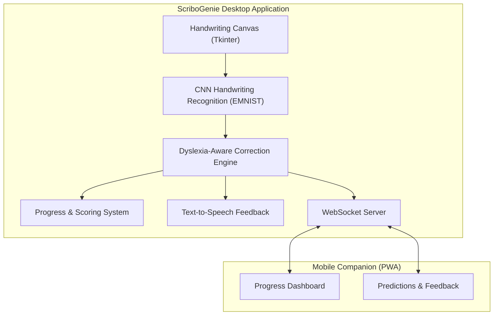

# ScriboGenie

> AI-powered multisensory handwriting assistant for children with learning disabilities.

---

## Overview

ScriboGenie is an AI-powered handwriting assistance system designed to support children with learning disabilities such as dyslexia and dysgraphia. The project combines machine learning, handwriting recognition, and a Flutter-based mobile application to provide an accessible and interactive handwriting learning experience.

The system captures handwritten input, processes it using a Python-based recognition engine, and analyzes writing patterns to provide intelligent feedback. By integrating artificial intelligence with assistive technology, ScriboGenie aims to improve handwriting practice, enhance learner confidence, and make personalized writing support more accessible.

---

## Problem Statement

Children with learning disabilities often struggle with handwriting due to difficulties in letter formation, writing fluency, and motor coordination. Traditional handwriting practice methods provide limited personalized guidance and little real-time feedback, making learning frustrating and less effective.

ScriboGenie addresses these challenges by providing an AI-assisted handwriting recognition system that analyzes handwritten input and delivers intelligent feedback to encourage continuous learning and independent practice.

---

## Key Features

- ✍️ AI-powered handwriting recognition using a Convolutional Neural Network (CNN).
- 📱 Flutter-based cross-platform mobile application.
- 🧠 Python backend for handwriting processing and recognition.
- 📊 Intelligent handwriting analysis with personalized feedback.
- 🎯 Designed to support learners with dyslexia and dysgraphia.
- 🔄 Modular architecture for future hardware integration and feature expansion.

---

## System Architecture

```
User
   │
   ▼
Flutter Mobile Application
   │
   ▼
Python Recognition Backend
   │
   ▼
CNN Handwriting Recognition Model
   │
   ▼
Writing Analysis & Feedback Engine
   │
   ▼
Feedback to User
```

---

## Technology Stack

| Category | Technologies |
|----------|--------------|
| Programming Languages | Python, Dart |
| Mobile Development | Flutter |
| Machine Learning | TensorFlow, Keras |
| Backend | Python |
| AI Model | Convolutional Neural Network (CNN) |
| Hardware Support | Raspberry Pi (Planned Integration) |
| Version Control | Git & GitHub |

---

## Project Structure

```
scribogenie/
│
├── backend/
│   ├── app.py
│   ├── recognizer_pi.py
│   ├── utils_pi.py
│   └── requirements.txt
│
├── mobile/
│   ├── lib/
│   ├── android/
│   ├── ios/
│   ├── web/
│   ├── windows/
│   ├── linux/
│   └── macos/
│
├── models/
│   └── myCnn.h5
│
├── docs/
│
├── web-interface/
│
├── README.md
├── LICENSE
└── .gitignore
```

---

## Installation

### Clone the repository

```bash
git clone https://github.com/sankavi03/scribogenie.git
```

### Navigate to the project

```bash
cd scribogenie
```

### Backend Setup

```bash
cd backend
pip install -r requirements.txt
python app.py
```

### Mobile Application

```bash
cd mobile
flutter pub get
flutter run
```

---

## How It Works

1. The user writes on the mobile application.
2. Handwritten input is captured and preprocessed.
3. The backend processes the handwriting.
4. The CNN model predicts handwritten characters.
5. The system analyzes writing quality.
6. Personalized feedback is provided to help improve handwriting.

---


## Future Enhancements

- Speech-assisted handwriting guidance.
- Real-time handwriting correction.
- Cloud synchronization.
- Progress tracking dashboard.
- Personalized learning plans.
- Raspberry Pi hardware integration.
- Multi-language handwriting support.
- Teacher and parent monitoring portal.

---
